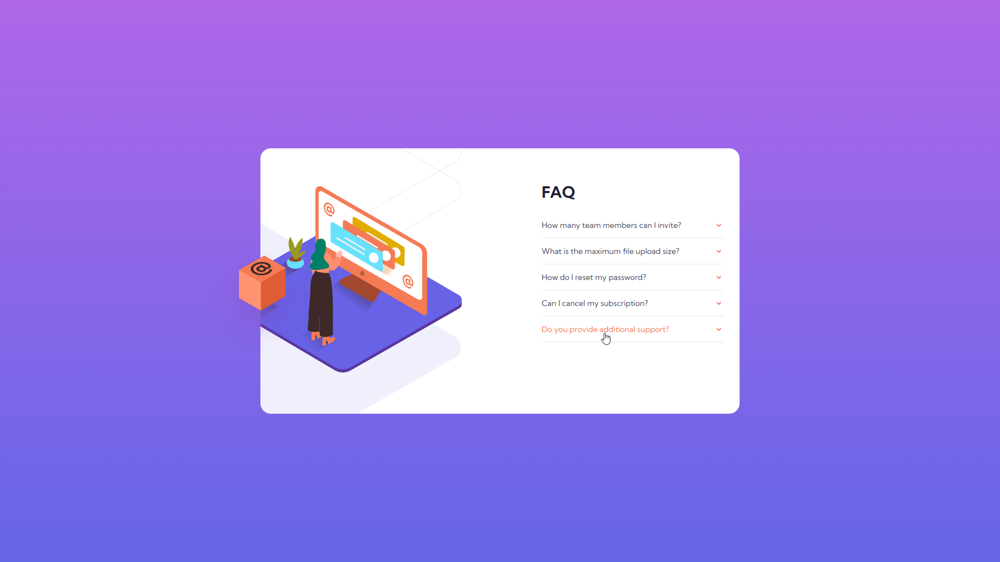
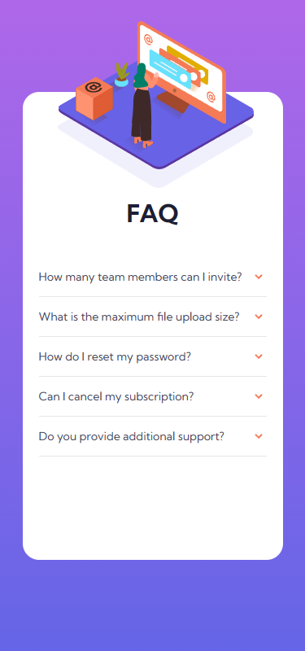

# Frontend Mentor - FAQ accordion card solution

This is a solution to the [FAQ accordion card challenge on Frontend Mentor](https://www.frontendmentor.io/challenges/faq-accordion-card-XlyjD0Oam). Frontend Mentor challenges help you improve your coding skills by building realistic projects. 

## Overview

### The challenge

Users should be able to:

- View the optimal layout for the component depending on their device's screen size
- See hover states for all interactive elements on the page
- Hide/Show the answer to a question when the question is clicked

#### Desktop Screenshot 🖥️

#### With Hover

#### Question Open

#### Mobile Screenshot 📱

### link 🔗

- Live Site URL: https://lkiryu.github.io/faq-accordion-card/

### Built with 🛠️
- HTML5
- CSS
- JS
---
### Author 👨‍💻
 Made by Matheus Antonio
